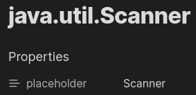
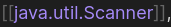
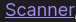
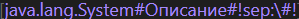
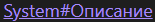
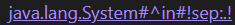
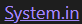

# Note Placeholder

[Obsidian](https://obsidian.md) plugin developed by XZSt4nce

[ English | [Русский](README_ru.md) ]

With Note Placeholder, you can add text that will be automatically inserted in place of the link in view mode.

## Installation

1. Go to the Obsidian settings
2. Go to the "Community plugins" tab
3. Enable community plugins (if not already enabled)
4. Click the "Browse" button
5. Enter "Note Placeholder" in the search and go to the plugin
6. Click on "Install" and then on "Enable"

## Usage

## Features

### Placeholder

You can add a placeholder for the note link by adding the `placeholder` (if it has not been redefined in the settings) property to it.

So this:

Will be displayed (in view mode) like this:

#### Always using placeholder instead of link name

You can disable the use of link names if the note has a placeholder
To do this, you need to set the `Use link name instead of placeholder` setting to `Always off`

#### Changing placeholder property name

In the settings, you can change the name of the property whose value will be used as a placeholder

### Separator

You can specify separator for a headers and a specific block by specifying the special header `sep`

**Example 1**:

Link in source mode:

Link in view mode:

**Example 2**:

Link in source mode:

Link in view mode:

**Video example**

### Disabling placeholder

By default, to disable the use of placeholder, you need to specify `!dp!'` as the link name if the value has not been changed in the settings

## Settings

- Placeholder property name : the name of the property, the text of which will be substituted for the link
- Use link name instead of placeholder
  - `default on, but off when specified` : the placeholder will only be shown if the link name is not specified
  - `always off` : the placeholder will always be shown instead of link name
- Text to disable placeholder : if you insert this text as the link name, the note name will be displayed (default: `!dp!`)
- Default header separator : text between the placeholder and headers/block (default: ` > `)

## License

MIT License

## Bug Report, Feature Request

If you find any bugs or have any feature requests, please report them on the [GitHub Issues](https://github.com/XZSt4nce/note-placeholder/issues). Thank you!

## Changelog

Versions are controlled by the rule below.

- Version x.y.z
  - x : increased when huge changes are made(ex. change of logic, etc.)
  - y : increased when features are newly added or changed
  - z : increased when bug fixes are made
