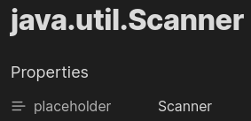
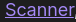
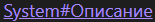
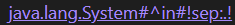

# Note Placeholder

[Obsidian](https://obsidian.md) plugin developed by XZSt4nce

[ [English](README.md) | Русский ]

С помощью Note Placeholder, вы можете добавить заполнитель, который будет автоматически подставлен в качестве имени ссылки в режиме просмотра.

## Установка

Для установки плагина нужно:

1. Зайти в настройки Obsidian
2. Перейти во вкладку "Сторонние плагины"
3. Включить сторонние плагины (если ещё не включены)
4. Нажать кнопку "Обзор"
5. В поиске ввести "Note Placeholder" и перейти к плагину
6. Нажать на "Установить", а затем на "Включить"

## Использование

## Функции

### Заполнитель

Вы можете добавить заполнитель для имени ссылки, добавив заметке свойство `placeholder` (если не было переопределено в настройках).

Так что это:

Будет отображено (в режиме просмотра) таким образом:

#### Всегда использовать заполнитель вместо имени ссылки

Вы можете отключить использование имён ссылок, если у заметки есть заполнитель
Чтобы это сделать, нужно установить настройку `Use link name instead of placeholder` в `Always off`

#### Изменение имени свойства заполнителя

В настройках можно изменить имя свойства, значение которого будет использоваться в качестве заполнителя

### Разделитель

Вы можете указать разделитель для заголовков или конкретного блока, указав специальный заголовок `sep`

**Пример 1**:

Ссылка в режиме редактирования:

Ссылка в режиме просмотра:

**Пример 2**:

Ссылка в режиме редактирования:

Ссылка в режиме просмотра:

**Видео пример**

### Отключение заполнителя

По умолчанию, чтобы отключить использование заполнителя нужно в качестве имени ссылки указать `!dp!`, если значение не было изменено в настройках

## Настройки

- Placeholder property name : имя свойства, текст которого будет подставляться вместо ссылки (по умолчанию: `placeholder`)
- Use link name instead of placeholder
  - `default on, but off when specified` : заполнитель будет использован только в том случае, если имя ссылки не определено
  - `always off` : заполнитель всегда будет использован в качестве имени ссылки
- Text to disable placeholder : если вы вставите этот текст в качестве имени ссылки, будет отображено имя заметки (по умолчанию: `!dp!`)
- Default headers separator : текст между заполнителем и заголовками/блоком (по умолчанию: ` > `)

## Лицензия

MIT License

## Сообщение Об Ошибках, Предложение Функций

Если вы нашли какую-то ошибку или у вас есть предложение, пожалуйста, напишите об этом в [GitHub Issues](https://github.com/XZSt4nce/note-placeholder/issues). Спасибо!

## Журнал изменений

Версии изменяются по правилам ниже.

- Версии x.y.z
  - x : увеличивается, когда происходят большие изменения (например, изменение логики и т.д.)
  - y : увеличивается, когда добавляются новые функции или изменяются старые
  - z : увеличивается, когда исправляются ошибки
